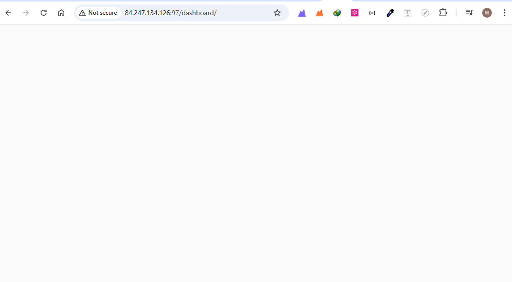
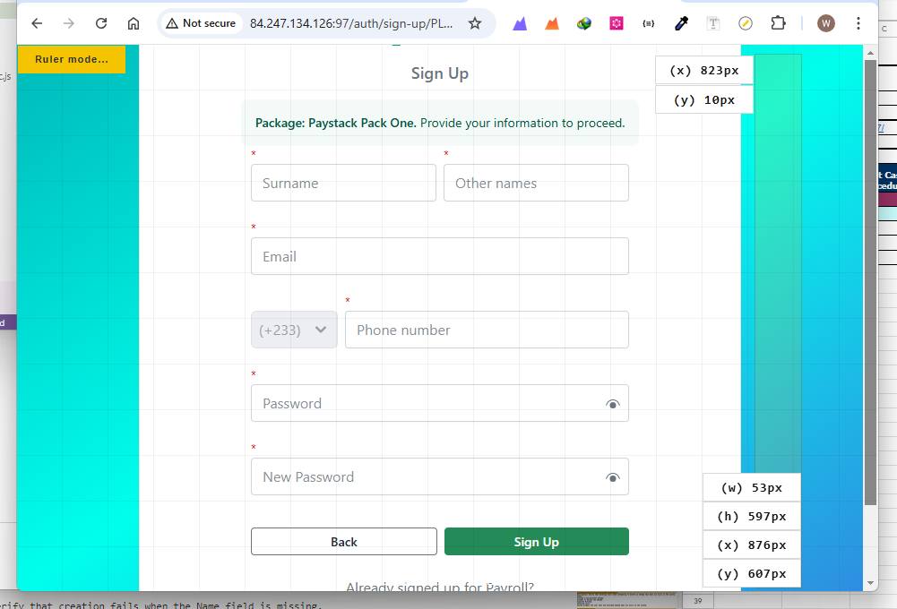
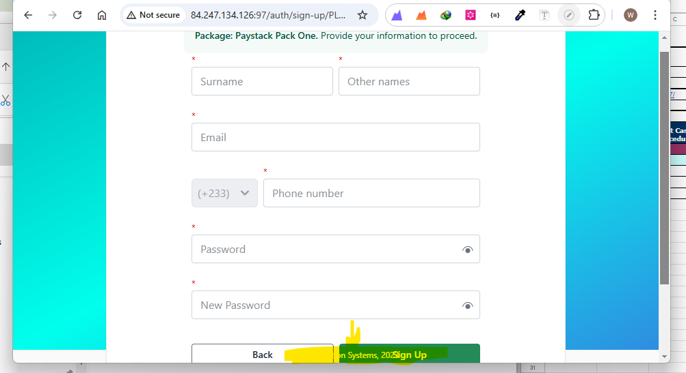

## Googlesheet

The google sheet can be accessed through the link below:
[Payroll_Test_Sheet](https://docs.google.com/spreadsheets/d/1ucM5NW_IjGLFmBphRdC8HCT1lATnbPYiFu-02cNmtY0/edit?usp=sharing)

# UI Defects

1. At a width of 950px and a zoom of 100%, the sidebar disappears and shows no hamburger icon , but reappears when the page width exceeds 1050px
 **`picture example`**

 

 **After Width Increment**

 

2. System displays a blank interface after some hours of being inactive.

3. When view height is decreased to below 800px , some items do not appear properly in line when the vertical scroll is introduced
**PICTURE EXAMPLES**

`View Height Above 800px`

`View Heights Below 800px`

---

---

For the above picture , kindly the area highlighted in yellow.
The **`copyright`** at the footer is not fixed

4. Validation for the email field must be checked again
`Email` field accepts inputs like `demo@demo` instead of `demo@demo.com`
